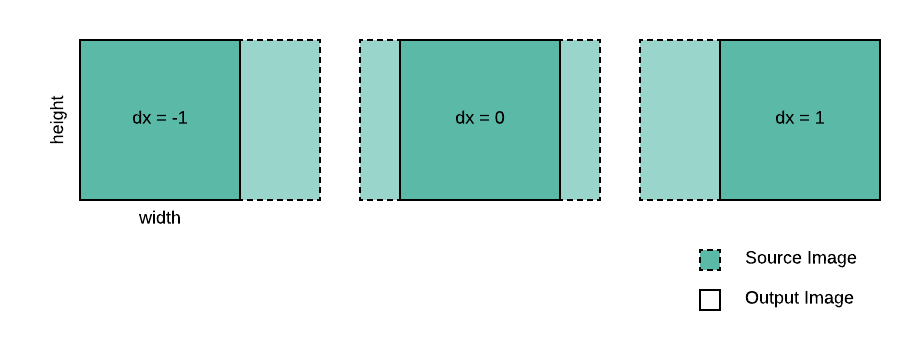
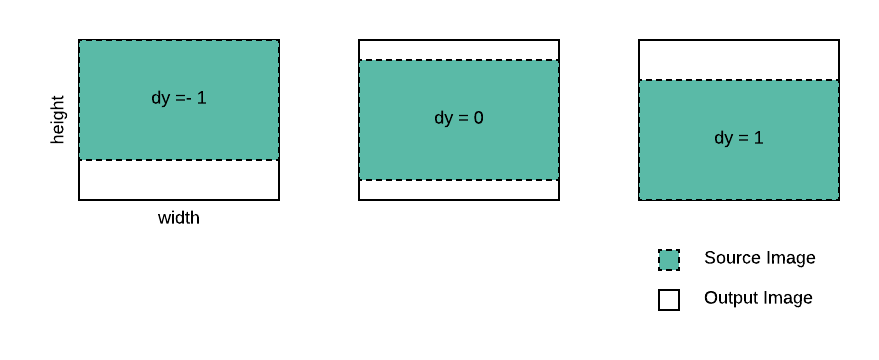
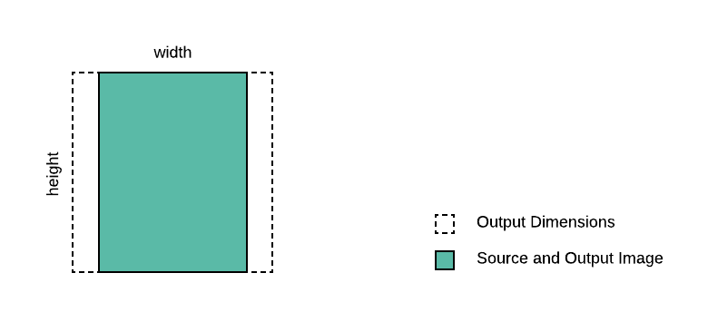

# rust-image-worker

Dynamically crop, resize and cache images, all on the CDN

## Why

The scenario:

- You need to display images optimized for the layout of your website.
- Perhaps these images get uploaded by your users, or they come from an external image provider.
- You don't want to send images larger than what is neccesary, because you are considerate of users who may be accessing your site from slower connections such as mobiles.
- Maybe you don't know what the size of all the source images are, but you still want them to fit neatly into your design.
- Or, maybe you want to allow your users to change how their profile images are cropped, to move and scale within fixed dimensions, without having to upload again.

I've used and built such services in the past. I thought it would be a straightforward yet useful thing to build with [Rust](https://www.rust-lang.org) and [WASM](https://webassembly.org)) on [Cloudflare workers](https://www.cloudflare.com/en-gb/products/cloudflare-workers/).

Rust has great native crates that do not need to pull in shared libraries or call out to other processes.

With workers we are able to cache the source and resulting images directly on the CDN.

### Caveat

This software is currently used only for demonstration purposes and you should be aware of the [limitations](#limitations) before using it for real.

## How to use

### Deploying the worker

1. Follow instructions to install 🤠[wrangler](https://github.com/cloudflare/wrangler).
2. Add your [account id and zone id](https://workers.cloudflare.com/docs/quickstart/api-keys/) to the [`wrangler.toml`](wrangler.toml)
3. Run `$ wrangler publish`

You should see something like:

```
🥳 Successfully published your script.
🥳 Successfully made your script available at image-worker...workers.dev
✨ Success! Your worker was successfully published. ✨
```

### Calling the worker

You will be able to call the worker at the domain provided,e.g. [http://image-worker...workers.dev](http://factorymethod.uk/image).

The URL path should be formatted as an image filename with a file extension signifying the target image format. Supported output formats are PNG (`.png`) and JPEG (`.jpg` or `.jpeg`).

The query parameters should include a combination of:

- **origin**: the full _URL_ to the source image (required)
- **mode**: one of _fill_, _fit_ and _limit_ (required, see [examples](#examples) for modes)
- **width**, **height**: the desired dimensions (both required when mode is _fill_ or _limit_, either one or both for _fit_)
- **dx**, **dy**: the relative position when the image is cropped, numbers between _-1.0_ (left/top) and _1.0_ (right/bottom) (default: _0.0_, center)
- **scale**: a positive rational number to scale the source image by (default: _1.0_)
- **bg**: a color in [hex triplet](https://en.wikipedia.org/wiki/Web_colors#Hex_triplet) format (default: transparent)

## Examples

### Fill mode

The source image is cropped in order to ensure that the full _width_ and _height_ is filled. The source image can be positioned using relative center offset _dx_ and _dy_.



Example:

[http://.../image.png?<br/>mode=fill&<br/>width=200&<br/>height=200&<br/>origin=https://.../test_pattern.png](http://factorymethod.uk/image.png?mode=fill&width=200&height=200&origin=http://factorymethod.uk/test_pattern.png)


### Fit mode

The output image is exactly sized according to the given width and height, with no cropping of the source image. The source image can be positioned using relative center offset _dx_ and _dy_.



Example:

[http://.../image.png?<br/>mode=fit&<br/>bg=666&<br/>width=200&<br/>height=200&<br/>origin=https://.../test_pattern.png](http://factorymethod.uk/image.png?bg=666&mode=fit&width=200&height=200&origin=http://factorymethod.uk/test_pattern.png)


### Limit mode

The source image is scaled to fit within the given _width_ and _height_.



Example:

[http://.../image.png?<br/>mode=limit&<br/>width=200&<br/>height=200&<br/>origin=https://.../test_pattern.png](http://factorymethod.uk/image.png?mode=limit&width=200&height=200&origin=http://factorymethod.uk/test_pattern.png)


## Limitations

- Cloudflare workers are [limited](https://developers.cloudflare.com/workers/writing-workers/resource-limits/) in the amount of CPU time they are allowed to take per request (between 5ms for free and 50ms for business/enterprise accounts). This means that large images (> 1000 pixels in width or height), sometimes run out of processing time.
- The JPEG decoder used by the Rust crate image requires [threads](https://rustwasm.github.io/2018/10/24/multithreading-rust-and-wasm.html), which I have not yet been able to get to work.

## License

Apache 2.0
